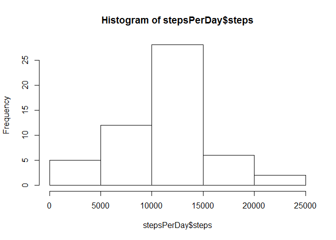
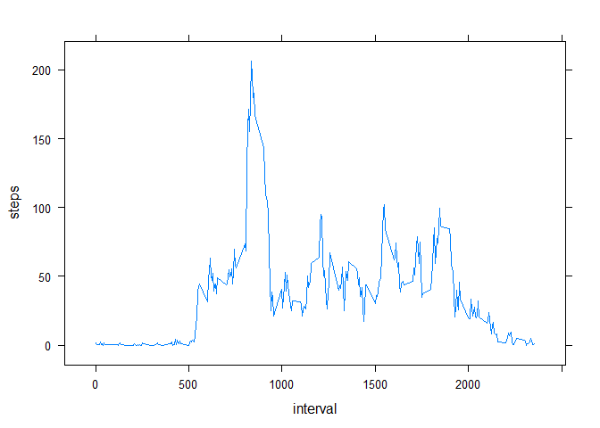
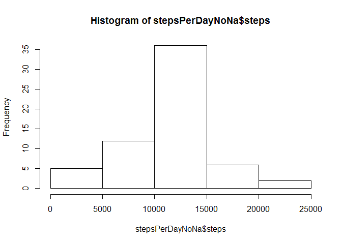
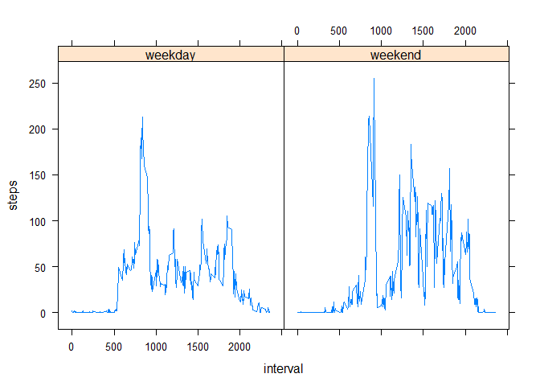

# Reproducible Research: Peer Assessment 1


## Loading and preprocessing the data

```r
unzip("activity.zip")
table<- read.csv("activity.csv",header = TRUE,sep = ",",stringsAsFactors = FALSE)
```
  transfotming the date data into date format

```r
table$date<- as.Date(table$date,format="%Y-%m-%d")
```
  take a look at the data

```r
summary(table)
```

```
##      steps             date               interval     
##  Min.   :  0.00   Min.   :2012-10-01   Min.   :   0.0  
##  1st Qu.:  0.00   1st Qu.:2012-10-16   1st Qu.: 588.8  
##  Median :  0.00   Median :2012-10-31   Median :1177.5  
##  Mean   : 37.38   Mean   :2012-10-31   Mean   :1177.5  
##  3rd Qu.: 12.00   3rd Qu.:2012-11-15   3rd Qu.:1766.2  
##  Max.   :806.00   Max.   :2012-11-30   Max.   :2355.0  
##  NA's   :2304
```


## What is mean total number of steps taken per day?

```r
stepsPerDay<-aggregate(steps~date,table,FUN=sum,na.action = na.omit)
hist(stepsPerDay$steps) 
```

 
 
 
  Mean number of steps per day

```r
mean(stepsPerDay$steps)
```

```
## [1] 10766.19
```
  Median number of steps per day

```r
median(stepsPerDay$steps)
```

```
## [1] 10765
```


## What is the average daily activity pattern?

```r
stepsPerInterval<- aggregate(steps~interval,table,FUN=mean,na.action = na.omit)
library(lattice)
xyplot(steps~interval,stepsPerInterval,type="l")
```

 
 
 
  The  5-minute interval, on average across all the days in the dataset, contains the maximum number of steps is :

```r
maxSteps<-max(stepsPerInterval$steps)
stepsPerInterval[stepsPerInterval$steps==maxSteps,"interval"]
```

```
## [1] 835
```


## Imputing missing values
Number of missing values in all columns are 

```r
sapply(table,function(x) sum(is.na(x)))
```

```
##    steps     date interval 
##     2304        0        0
```
  We notice that all missing values are in the steps, we replace every NA with the average of steps in the same interval over other days 

```r
tableNoNa <- table
ind <- is.na(tableNoNa$steps)
ints <- tableNoNa$interval[ind]
tableNoNa$steps[ind]<- stepsPerInterval$steps[stepsPerInterval$interval %in% ints]
```
  Calculate sum of steps every day

```r
stepsPerDayNoNa<-aggregate(steps~date,tableNoNa,FUN=sum)
hist(stepsPerDayNoNa$steps) 
```

 
 
 
  Mean number of steps per day

```r
mean(stepsPerDayNoNa$steps)
```

```
## [1] 10766.19
```
  Median number of steps per day

```r
median(stepsPerDayNoNa$steps)
```

```
## [1] 10766.19
```
  we notice the mean is still the same as before filling the NA but the median is now more precise and near the mean value (in my case they are now the same number)
## Are there differences in activity patterns between weekdays and weekends?

```r
tableNoNa$dayType = factor(tableNoNa$date, levels = c("weekend","weekday"))
tableNoNa$dayType <- "weekday"
tableNoNa$dayType[(which(weekdays(tableNoNa$date) %in% c("Sudnay","Saturday")))]<-"weekend"
stepsPerIntervalNoNa<- aggregate(steps~interval+dayType,tableNoNa,FUN=mean)
library(lattice)
xyplot(steps~interval|dayType,stepsPerIntervalNoNa,type="l")
```

 
